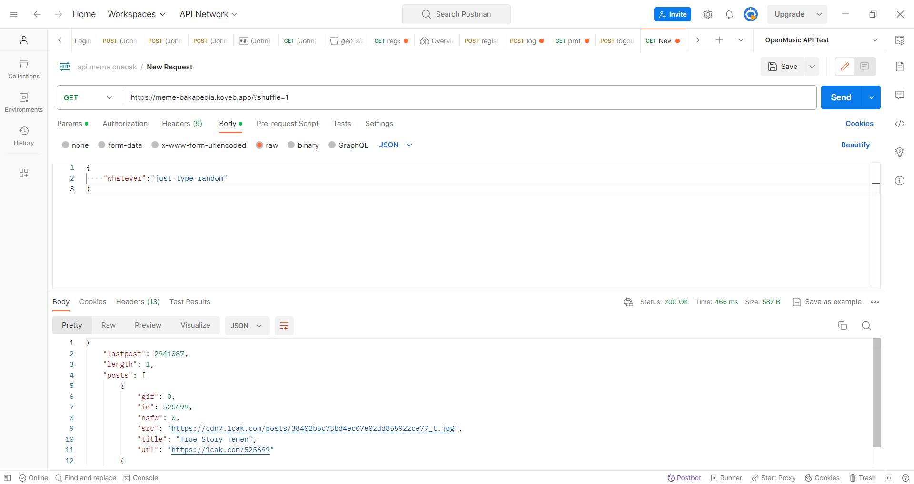

  
1cak - An Indonesian web that provide lot of fun.

## Endpoint

Lol -> 10 Recent stored posts on database  
Example: `https://onecak.azurewebsites.net/?lol`

Shuffle -> Select random posts from database  
Example: `https://onecak.herokuapp.com/?shuffle=5`

## Update Endpoint (koyeb)

Lol -> 10 Recent stored posts on database  
Example: `https://meme-bakapedia.koyeb.app/?lol` 
Postman:  
 
Shuffle -> Select random posts from database  
Example: `https://meme-bakapedia.koyeb.app/?shuffle=1` 
Postman: 
 

## Endpoint With No Json to send (koyeb)
Lol -> 10 Recent stored posts on database  
Example: `https://meme-bakapedia.koyeb.app/new?lol` 
Shuffle -> Select random posts from database  
Example: `https://meme-bakapedia.koyeb.app/new?shuffle=1` 
* link is not active request to me if you want to use it https://t.me/rixkyduwi

## Info

- **_Heroku maybe deprecated, please use azure instead._**
- You need to open the url first to gain access to src (image/gif)  
   `url and src can be obtained from API response`

### Credit

- [dickymuliafiqri](https://github.com/dickymuliafiqri)
- [1cak.com](https://1cak.com)
